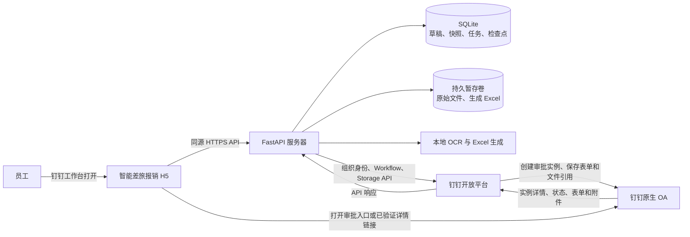
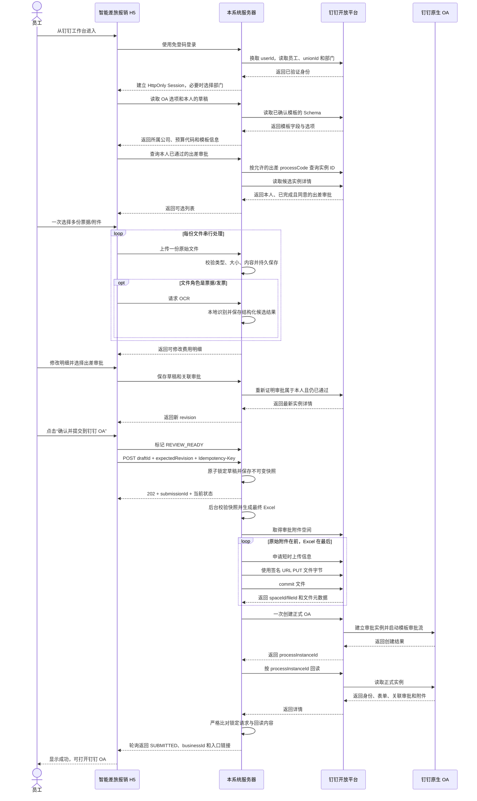
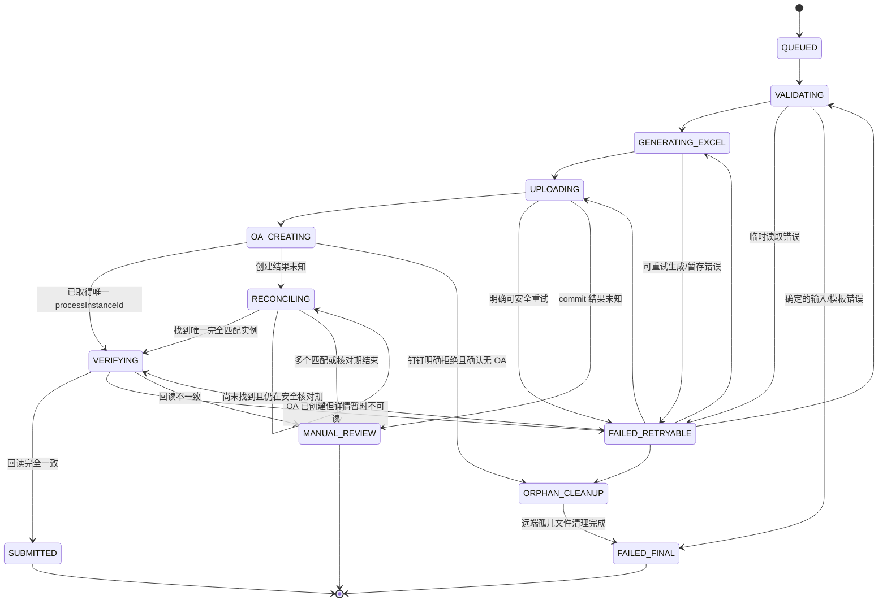

# 钉钉 OA 差旅报销集成设计

文档状态：与当前实现对齐，生产验收前基线；数据库迁移基线：`20260904_0011`；适用技术栈：Vue 3 + TypeScript、FastAPI、SQLite、钉钉企业内部应用。

## 1. 要实现的结果

员工从钉钉工作台打开“智能差旅报销”，在一个页面内完成以下事情：

1. 选择所属公司、预算代码和报销项目；
2. 选择发票、车票、行程单等原始文件并上传一次；
3. 检查并修改 OCR 生成的费用明细；
4. 从本人已通过的出差审批中选择需要关联的审批单；
5. 点击一次“确认并提交到钉钉 OA”。

点击确认后，服务器锁定这次填写的数据，重新计算金额并生成最终报销 Excel。服务器把员工上传的原始文件和这个 Excel 一起传到钉钉审批附件空间，然后一次性创建正式的“差旅费报销申请”。关联出差审批写入钉钉的关联审批控件，原始文件和 Excel 写入同一个附件控件。

员工不需要下载 Excel，也不需要再手工选择 Excel 上传。Windows、macOS、Android 和 iOS 使用的都是同一套 H5 流程；设备只负责第一次选择本机文件，后续生成、上传和发起 OA 都由服务器完成。

系统范围到“正式发起 OA 并回读确认表单、关联审批和附件正确”为止。审批流转、财务审核、人工打款以及打款后的业务记录继续由钉钉和财务人员处理。

## 2. 关键名词

| 名词 | 简单解释 |
|---|---|
| 报销草稿 | 员工提交前保存在本系统里的报销内容，不是钉钉 OA 草稿 |
| 报销 Excel | 本系统根据员工最终确认的数据生成的 `.xlsx` 文件 |
| `processCode` | 一类钉钉审批模板的标识，例如“差旅费报销申请”模板的标识 |
| `processInstanceId` | 某一张已经发起的具体审批单的唯一标识 |
| Schema | 钉钉审批模板的字段说明，包括字段 ID、类型和选项 |
| 模板指纹 | 对 Schema 计算的 SHA-256；模板字段变化时，指纹也会变化 |
| 关联审批 | 钉钉 `RelateField` 控件，保存出差审批的 `processInstanceId`，可在 OA 中打开原审批 |
| 审批附件 | 钉钉 `DDAttachment` 控件里的文件引用 |
| 审批附件空间 | 钉钉给审批附件提供的专用存储空间，由服务器取得并上传文件 |
| commit | 文件字节上传后，通知钉钉把它登记成正式文件并返回 `spaceId/fileId` |
| 幂等 | 同一次提交即使重复点击、刷新或网络重试，也只能创建一张 OA |
| 快照 | 员工确认时冻结的一整套数据，后台后续只能按它生成 Excel 和 OA |
| CAS | 更新时同时检查版本号；如果别人已改过数据，本次更新拒绝，避免互相覆盖 |
| 租约 | 后台任务暂时取得的处理权；进程崩溃后租约过期，另一个任务可安全接手 |
| 孤儿附件 | 已经在钉钉完成 commit，但确定没有任何 OA 引用的文件 |
| 人工核对 | 系统无法安全判断远端是否已产生文件或 OA 时停止自动操作，由管理员确认 |

## 3. 总体架构



这里有两份不同位置的文件：

- 服务器持久暂存卷保存员工上传的原件和待提交的 Excel，用于重启恢复；
- 钉钉审批附件空间保存完成 commit 的远端文件，OA 表单通过 `spaceId/fileId` 引用它们。

钉钉公开接口没有给这类审批空间一个可以可靠对外展示的“个人盘”或“公司盘”名称。产品页面只称它为“审批附件空间”，也不要求员工进入钉盘操作。

## 4. 完整时序



## 5. 客户端和服务器的分工

### 5.1 H5 客户端

H5 负责员工看得见的交互：

- 钉钉免登和多部门选择；
- 创建、保存、恢复和切换报销草稿；
- 展示从模板读取的所属公司、预算代码；
- 选择本地原始文件；
- 把票据/发票标为 `EXPENSE_SOURCE`，把行程单等只需附上的材料标为 `ATTACHMENT_ONLY`；
- 展示 OCR 候选结果，允许修改或手工增加费用行；
- 查询并选择本人已通过的出差审批；
- 下载“当前已保存草稿”的 Excel 预览；
- 在正式提交前给出不可撤销提示；
- 展示后台进度、最终 OA 编号和打开入口。

H5 不取得企业 access token，不保存 `Client Secret`，不调用钉钉服务端文件上传接口，也不负责把生成的 Excel 再上传一次。

### 5.2 FastAPI 服务器

服务器负责可信数据和全部远端写操作：

- 缓存企业 access token；
- 把免登码换成当前员工身份，并把 `userId`、`unionId`、企业和部门绑定到 Session；
- 保存模板目录、字段映射、Schema 指纹和配置版本；
- 查询、复核并冻结关联出差审批；
- 安全接收并持久保存原始文件；
- 后端重新计算补助、总额、票据数和人民币大写；
- 根据锁定快照生成最终 Excel；
- 申请上传信息、PUT、commit、创建 OA 和回读 OA；
- 保存幂等记录、状态、租约和每一个危险远端操作前的检查点；
- 自动重试安全操作，处理确定的孤儿文件，对不确定结果停止自动写操作；
- 按文件生命周期删除服务器本地副本。

## 6. 模板目录和后续换 `processCode`

### 6.1 管理员配置流程

模板配置不是写死在前端，也不是只替换一个字符串。管理员使用模板目录接口完成下面的流程：

1. 输入报销模板 `processCode` 和一个或多个允许关联的出差模板；
2. 调用检查接口，从钉钉读取每个模板最新 Schema；
3. 把报销模板的 10 个业务字段映射到真实控件 ID；
4. 把每个出差模板的开始日期、结束日期映射到真实控件 ID；
5. 为每个出差模板选择它对应的报销“出差类别”精确选项；
6. 确认关联审批控件允许这些出差模板，并确认已做过关联审批冒烟测试；
7. 使用 Schema 指纹和 `expectedConfigVersion` 保存配置。

保存时服务器会再次读取 Schema。只要字段名称不同但业务含义和控件类型仍符合下表，就能通过重新映射适配，通常不需要改代码。若新模板缺少业务字段、控件类型不兼容、把字段移入不支持的复杂容器，或增加了必须由系统填写的新业务含义，才需要修改适配代码。

### 6.2 报销模板固定业务字段

| 逻辑键 | 页面含义 | 允许的钉钉控件类型 | 值的来源 |
|---|---|---|---|
| `company` | 所属公司 | `DDSelectField` | 当前 Schema 中的精确选项 |
| `budgetCode` | 预算代码 | `DDSelectField` | 当前 Schema 中的精确选项 |
| `travelType` | 出差类别 | `DDSelectField` | 关联出差模板对应的精确选项 |
| `startDate` | 开始日期 | `DDDateField` | 所有关联出差审批的最早日期 |
| `endDate` | 结束日期 | `DDDateField` | 所有关联出差审批的最晚日期 |
| `durationDays` | 时长（天） | `NumberField` | 开始、结束日期按自然日计算 |
| `description` | 明细说明 | `TextField` 或 `TextareaField` | 费用行、补助和合计的服务器格式化结果 |
| `reimbursementAmount` | 报销金额 | `MoneyField` 或 `NumberField` | 服务器计算总额 |
| `relatedApprovals` | 关联审批单 | `RelateField` | 已复核的出差 `processInstanceId` 数组 |
| `attachments` | 附件 | `DDAttachment` | 原始附件和最终 Excel 的远端文件元数据 |

前端显示的所属公司和预算代码来自已确认 Schema，不能写死测试企业的选项或控件 ID。

### 6.3 模板变更保护

`oa_template_profiles` 保存配置版本、完整 Schema、字段映射、确认指纹、允许的出差模板和确认人。草稿创建时绑定当时的 `processCode + configVersion + schemaFingerprint`。

正式提交前后台还会重新读取报销模板和所用出差模板。指纹变化时，系统在上传任何钉钉文件之前终止这次提交，要求管理员重新检查映射，避免把金额或附件写进错误字段。已绑定旧配置的可编辑草稿不会静默改成新模板。

管理员接口见 [OA 模板目录 API](../backend/app/api/oa_templates.py)，字段契约见 [模板适配服务](../backend/app/services/oa_template_profiles.py)。

## 7. 查询和关联出差审批

### 7.1 候选审批

服务器只使用 Session 中的当前 `userId`，不接受前端指定其他员工。默认查询上海时区最近 120 个自然日；自定义起止日期必须同时填写，范围不能超过 120 天。

每个已配置的出差模板都按下面条件查询和回读：

```text
processCode 属于管理员确认的出差模板
AND userIds 只有当前员工
AND status == COMPLETED
AND 实例 originatorUserId == 当前员工
AND 实例 result == agree
AND 开始、结束日期能从已映射控件准确读取
```

一页最多取 20 个 ID；整个查询最多接受 200 个候选，详情并发上限为 5。超出时要求员工缩小日期范围。关键词只匹配审批标题或审批编号。

### 7.2 保存选择时再次证明

前端提交的每个选择只包含：

```json
{
  "processInstanceId": "实例ID",
  "profileKey": "管理员配置的出差模板键",
  "queryWindow": {"from": "2026-08-01", "to": "2026-09-01"}
}
```

服务器会用原查询窗口重新查询实例 ID，再读取详情，证明这张审批仍在当前员工可选列表中。服务器保存标题、业务编号、出差日期、来源模板、Schema 指纹、查询窗口和复核时间。多张出差审批必须对应同一种“出差类别”，且每张出差日期必须与报销行程或费用日期有重叠。

正式提交阶段再做一次同样的远端复核，防止员工保存草稿后原审批被撤销或模板发生变化。

### 7.3 写入 `RelateField`

写给钉钉的是具体实例 ID 数组的 JSON 字符串：

```json
{
  "name": "关联审批单",
  "value": "[\"instance-id-1\",\"instance-id-2\"]",
  "id": "从已确认 Schema 取得的控件ID",
  "componentType": "RelateField"
}
```

这里不能使用审批编号 `businessId`，也不能使用模板的 `processCode`。

## 8. 草稿、原始文件、OCR 和 Excel

### 8.1 草稿

报销草稿持久保存在 SQLite，按企业、员工和所选部门隔离。每次修改都必须带 `expectedRevision`。版本不一致时返回冲突，前端重新读取服务器状态，不能盲目重放写请求。

草稿状态：

```text
DRAFT --检查完整性--> REVIEW_READY --正式提交原子锁定--> LOCKED
  ^                            |
  |--------再次修改------------|

DRAFT / REVIEW_READY --超过 expiresAt--> EXPIRED
```

`REVIEW_READY` 只是“内容已检查，可以提交”，仍不是钉钉 OA。任何修改会增加 revision 并回到 `DRAFT`。创建提交记录时，草稿、提交快照和原始附件清单在一个数据库事务中写入，草稿同时变成 `LOCKED`。

### 8.2 文件角色和保存位置

- `EXPENSE_SOURCE`：发票、车票等需要 OCR 的票据；
- `ATTACHMENT_ONLY`：行程单等只需随 OA 一起提交的材料，不执行 OCR。

当前持久文件允许 `jpg/jpeg/png/pdf`，单文件默认上限 20 MiB。前端允许一次选择多份，但逐份调用上传接口；服务器先做扩展名、magic bytes、图片或 PDF 内容检查，再把文件放入受控持久暂存卷。存储路径只使用服务器生成的 UUID，不使用原文件名作为路径。

数据库保存大小和 SHA-256。后续 OCR、生成快照和远端上传每次都按这两个值重新核对文件，避免磁盘内容被替换。持久页面恢复后只显示文件名和状态，不伪造已经失效的浏览器本地预览。

### 8.3 OCR 和费用明细

`EXPENSE_SOURCE` 上传后可调用持久 OCR 接口。服务器保存的是页面需要的结构化候选结果和状态：`NOT_REQUESTED/RUNNING/COMPLETE/FAILED`。每条由 OCR 产生的费用行都通过 `sourceFileId` 保存来源文件 ID，不用金额、日期或说明文字反推关系。重新识别更新同一条候选，不重复增加明细；员工已经手工修改的费用行不会被迟到的 OCR 响应覆盖。

对于每一份已完成或识别失败的 `EXPENSE_SOURCE`，草稿必须明确二选一：关联到一条费用明细，或记录为员工明确不计入明细。从费用明细中移除 OCR 行时保留原始附件并记录不计入；员工可以显式重新加入。`ATTACHMENT_ONLY` 不参与这项费用去向检查。

草稿输入使用 `ocrDispositionVersion` 区分这套规则，当前版本为 `1`。历史草稿缺少该字段时按版本 `0` 读取，不会被默默当成新版本。版本 `0` 只在一条历史费用行与一份 OCR 候选的 `category/date/displayDate/description/amount/receiptCount` 六个字段全部相同，且费用行与候选两侧都是唯一一对一匹配时，才自动补上 `sourceFileId`。任一字段被编辑、不匹配或缺失，以及一对多/多对一歧义，都保持为“未决定”，既不自动增加费用行，也不自动忽略。

页面对每一份“未决定”的终态 `EXPENSE_SOURCE` 明确显示“添加到费用明细”和“忽略此票据”。选择忽略只把文件 ID 写入 `dismissedOcrFileIds`，原始文件仍作为 OA 附件；所有票据都明确决定前，前端禁止保存、进入复核和正式提交。后端对版本 `0` 的直接保存或复核请求也执行同一个唯一精确匹配；只要仍有未决定票据，就返回 `REIMBURSEMENT_DRAFT_NOT_READY`，防止绕过页面造成静默漏报。全部决定后才持久为版本 `1`。

版本 `1` 中，`COMPLETE/FAILED` 的活动 `EXPENSE_SOURCE` 必须恰好出现在“费用行的来源文件 ID”或 `dismissedOcrFileIds` 其中一处，不能两处都有，也不能两处都没有。新版本中如果 OCR 成功回包在网络中丢失，刷新后可按持久的文件 ID 恢复唯一候选，不会生成第二条费用行。

删除原始文件或把它改为 `ATTACHMENT_ONLY` 时，版本 `1` 使用持久的 `sourceFileId` 原子清理对应费用行和不计入记录；版本 `0` 先对这一份目标文件执行相同的唯一精确匹配，再与文件变更一起原子移除匹配行。如果还有其他无法判定的历史候选，草稿仍保留版本 `0`，不会因删除一份文件而自动增加、忽略或重新关联其他票据。

OCR 只辅助填写。正式金额、补助、总额、票据数和人民币大写始终由服务器从保存后的费用数据重新计算。

### 8.4 Excel 预览与最终 Excel

“预览 Excel”只针对当前已保存 revision，生成后下载给员工检查，不会进入提交清单。正式提交时后台从不可变快照重新生成一份最终 Excel，并校验 Excel 模板 SHA-256。最终 Excel 进入持久暂存区，再由服务器直接上传到钉钉；员工无需手工处理它。

## 9. 正式提交的服务器流程

### 9.1 锁定不可变快照

提交请求必须携带规范 UUID 格式的 `Idempotency-Key` 和当前 `expectedRevision`。服务器先按当前员工和 `draftId` 查找已有提交；已存在时直接返回同一条记录，即使刷新后的浏览器生成了新幂等键或拿着旧 revision，也不会创建第二条任务。

第一次提交会冻结：

- 企业、员工 `userId/unionId`、姓名和部门；
- 报销模板配置版本、Schema、指纹和 10 个字段映射；
- 员工确认的输入、服务器计算结果和 OA 字段值；
- 已复核出差审批及其日期、模板和查询窗口；
- 原始附件顺序、角色、存储键、大小、类型和 SHA-256；
- Excel 模板 SHA-256、最终文件名；
- `snapshotVersion=1` 和整个规范 JSON 的 SHA-256。

后台只使用这份快照，不再读取前端当前表单作为权威数据。数据库触发器禁止在提交创建后修改快照。

### 9.2 上传原始文件和 Excel

每个文件执行相同的三段流程：

1. 申请审批附件上传信息；
2. 对钉钉返回的短时 HTTPS 签名地址执行 `PUT`；
3. 调用 commit，取得正式的 `spaceId/fileId/fileName/fileSize/fileType`。

附件清单严格保持“所有原始文件在前，生成的 Excel 在最后”。钉钉可能因重名自动改名，因此 OA 中使用 commit 返回的最终文件名。

写入 `DDAttachment` 的值是整个数组的 JSON 字符串，例如：

```json
{
  "name": "附件",
  "value": "[{\"spaceId\":\"...\",\"fileId\":\"...\",\"fileName\":\"发票.pdf\",\"fileSize\":12345,\"fileType\":\"pdf\"},{\"spaceId\":\"...\",\"fileId\":\"...\",\"fileName\":\"差旅费报销单-员工-项目.xlsx\",\"fileSize\":12000,\"fileType\":\"xlsx\"}]",
  "id": "从已确认 Schema 取得的控件ID",
  "componentType": "DDAttachment"
}
```

取得 `fileId` 只代表文件已经在审批附件空间，不能代表 OA 已创建。

### 9.3 一次创建正式 OA

服务器持久保存将要发送的规范请求 JSON、请求 SHA-256 和 `oaCreateStartedAt`，然后只调用一次：

```http
POST /v1.0/workflow/processInstances
```

核心请求结构：

```json
{
  "processCode": "已确认的报销模板processCode",
  "originatorUserId": "当前员工userId",
  "deptId": 123456,
  "microappAgentId": 123456789,
  "formComponentValues": [
    {"name": "所属公司", "value": "选项值", "id": "...", "componentType": "DDSelectField"},
    {"name": "预算代码", "value": "选项值", "id": "...", "componentType": "DDSelectField"},
    {"name": "出差类别", "value": "选项值", "id": "...", "componentType": "DDSelectField"},
    {"name": "开始日期", "value": "2026-09-01", "id": "...", "componentType": "DDDateField"},
    {"name": "结束日期", "value": "2026-09-03", "id": "...", "componentType": "DDDateField"},
    {"name": "时长（天）", "value": "3", "id": "...", "componentType": "NumberField"},
    {"name": "明细说明", "value": "...", "id": "...", "componentType": "TextareaField"},
    {"name": "报销金额", "value": "972.39", "id": "...", "componentType": "NumberField"},
    {"name": "关联审批单", "value": "[\"travel-instance-id\"]", "id": "...", "componentType": "RelateField"},
    {"name": "附件", "value": "[{...}]", "id": "...", "componentType": "DDAttachment"}
  ]
}
```

请求不传 `approvers`。审批人、条件分支、会签、或签和抄送继续使用钉钉模板中已经发布的流程规则。

### 9.4 回读才算成功

创建接口返回 `processInstanceId` 后，服务器立即读取该实例并严格检查：

- 发起员工和发起部门；
- 每个已提交字段的控件 ID、名称、控件类型、业务别名和值；
- `RelateField` 中全部实例 ID；
- `DDAttachment` 中全部远端附件及顺序；
- 返回实例 ID与创建结果一致；
- 钉钉返回可展示的 `businessId`。

普通字段按精确字符串比较，关联审批和附件等 JSON 控件按严格 JSON 语义比较。全部一致后才把状态写成 `SUBMITTED`，并把所有远端上传记录写成 `LINKED`。

### 9.5 打开 OA 的链接

提交状态接口始终返回 `processInstanceId`、`businessId` 和可空的 `approvalUrl`。

- 若 `DINGTALK_APPROVAL_DETAIL_URL_TEMPLATE` 为空，当前实现生成的是带当前 `corpId` 的钉钉原生审批入口；它不是某张审批的详情深链；
- 若企业已经在实际客户端中验证了详情链接格式，可配置一个绝对 `https://` 或 `dingtalk://` 模板。模板必须且只能包含一个 `{processInstanceId}`，服务器会对实例 ID 做 URL 编码后替换；
- 未验证的详情深链不能写成默认值。即使只能打开审批入口，页面仍展示 `businessId` 和 `processInstanceId` 供员工查找和管理员排障。

## 10. 钉钉接口调用清单

| 目的 | 方法与路径 | 关键输入 |
|---|---|---|
| 组织 access token | `POST /v1.0/oauth2/{corpId}/token` | 后端 Client ID、Client Secret |
| 免登码换 `userId` | `POST /topapi/v2/user/getuserinfo` | 一次性免登码 |
| 读取员工和 `unionId` | `POST /topapi/v2/user/get` | 当前 `userId` |
| 读取部门 | `POST /topapi/v2/department/get` | 员工合法部门 ID |
| 读取审批 Schema | `GET /v1.0/workflow/forms/schemas/processCodes` | `processCode` |
| 查询审批实例 ID | `POST /v1.0/workflow/processes/instanceIds/query` | 模板、时间窗、当前员工、状态 |
| 读取审批详情 | `GET /v1.0/workflow/processInstances` | `processInstanceId` |
| 取得审批附件空间 | `POST /v1.0/workflow/processInstances/spaces/infos/query` | 当前 `userId`、应用 `agentId` |
| 申请文件上传信息 | `POST /v1.0/storage/spaces/{spaceId}/files/uploadInfos/query` | `unionId`、文件名和大小 |
| 上传文件字节 | 钉钉返回的短时签名 HTTPS URL | 返回的指定请求头和原始字节 |
| commit 文件 | `POST /v1.0/storage/spaces/{spaceId}/files/commit` | `unionId`、`uploadKey`、文件元数据 |
| 探测已 commit 文件 | `POST /v1.0/storage/spaces/{spaceId}/dentries/{fileId}/query` | `unionId` |
| 回收确定的孤儿文件 | `DELETE /v1.0/storage/spaces/{spaceId}/dentries/{fileId}` | `unionId`、`toRecycleBin=true` |
| 创建正式 OA | `POST /v1.0/workflow/processInstances` | 锁定并持久化的创建请求 |

Workflow 适配代码见 [workflow.py](../backend/app/integrations/dingtalk/workflow.py)，Storage 适配代码见 [storage.py](../backend/app/integrations/dingtalk/storage.py)。

## 11. 本系统 API

所有路径都带 `/api` 前缀。读取接口要求有效 Session；写接口还要求当前 CSRF token。管理员写接口要求管理员 Session 和 CSRF。

### 11.1 身份

| 方法与路径 | 用途 |
|---|---|
| `GET /api/config/public` | 返回前端免登需要的 CorpId、Client ID 等公开配置 |
| `POST /api/auth/dingtalk` | 用免登码建立服务端 Session |
| `GET /api/me` | 恢复当前身份并轮换 CSRF token |
| `POST /api/me/department` | 从钉钉确认过的部门中选择本次报销部门 |
| `POST /api/auth/logout` | 注销 Session |

### 11.2 模板目录

| 方法与路径 | 用途 |
|---|---|
| `POST /api/admin/oa/templates/catalog/inspect` | 读取候选报销/出差模板 Schema，展示字段供映射 |
| `GET /api/admin/oa/templates/catalog` | 读取当前确认配置和兼容状态 |
| `PUT /api/admin/oa/templates/catalog` | 按配置版本确认整个模板目录 |
| `GET /api/oa/reimbursements/options` | 返回员工可选的公司、预算和出差模板信息 |
| `GET /api/oa/travel-approvals?from=&to=&q=` | 查询当前员工本人已通过的出差审批 |

### 11.3 草稿和持久文件

| 方法与路径 | 用途 |
|---|---|
| `POST /api/reimbursements/drafts` | 创建草稿；请求的 `expectedRevision` 必须为 `0` |
| `GET /api/reimbursements/drafts` | 分页列出当前员工、当前部门的草稿 |
| `GET /api/reimbursements/drafts/{draftId}` | 读取草稿详情、计算结果和已关联审批 |
| `PUT /api/reimbursements/drafts/{draftId}` | 按 `expectedRevision` 保存输入 |
| `DELETE /api/reimbursements/drafts/{draftId}?expectedRevision=` | 删除未锁定草稿及其本地文件 |
| `PUT /api/reimbursements/drafts/{draftId}/related-approvals` | 远端复核并原子替换关联审批 |
| `POST /api/reimbursements/drafts/{draftId}/review` | 检查完整性并标记 `REVIEW_READY` |
| `GET /api/reimbursements/drafts/{draftId}/files` | 读取持久附件清单 |
| `POST /api/reimbursements/drafts/{draftId}/files?expectedRevision=&role=` | 上传一份持久原始文件 |
| `PATCH /api/reimbursements/drafts/{draftId}/files/{fileId}` | 按 revision 修改文件名或角色 |
| `DELETE /api/reimbursements/drafts/{draftId}/files/{fileId}?expectedRevision=` | 删除一份未锁定草稿文件 |
| `POST /api/reimbursements/drafts/{draftId}/files/{fileId}/ocr` | 对一份 `EXPENSE_SOURCE` 文件识别或重试 |
| `POST /api/reimbursements/drafts/{draftId}/excel-preview` | 从当前保存的 revision 生成预览下载 |

### 11.4 正式提交和恢复

| 方法与路径 | 用途 |
|---|---|
| `POST /api/oa/reimbursements/{draftId}/submit` | 原子锁定草稿并创建持久后台任务；固定返回 HTTP 202 |
| `GET /api/oa/reimbursements/submissions/{submissionId}` | 按任务 ID 轮询进度 |
| `GET /api/oa/reimbursements/drafts/{draftId}/submission` | 按草稿只读查找已有任务，用于另一设备或浏览器存储丢失后的恢复 |

提交请求：

```http
POST /api/oa/reimbursements/{draftId}/submit
X-CSRF-Token: <当前会话token>
Idempotency-Key: 11111111-1111-4111-8111-111111111111
Content-Type: application/json

{"expectedRevision": 8}
```

进度响应的核心结构：

```json
{
  "submissionId": "...",
  "draftId": "...",
  "status": "UPLOADING",
  "statusVersion": 5,
  "attemptCount": 1,
  "processInstanceId": null,
  "businessId": null,
  "approvalUrl": null,
  "error": null,
  "pollAfterMs": 1500,
  "createdAt": "...",
  "updatedAt": "...",
  "submittedAt": null
}
```

终态的 `pollAfterMs` 为 `0`。按草稿恢复的 GET 不修改草稿、不新建任务、不需要 CSRF；它仍按企业、员工和当前部门隔离，不属于当前身份时统一返回 404。

前端在发送第一次 POST 之前，把同一 `draftId` 的 UUID 幂等键保存在 `sessionStorage`。同一页面重复点击会合并成同一个请求；刷新后优先按保存的 `submissionId` 继续轮询。若换设备或浏览器存储丢失，锁定草稿通过只读 draft 查询找到服务器已有任务，不再次 POST。

## 12. 状态机、重试和崩溃恢复

### 12.1 提交状态



员工看到的 12 个状态是：

`QUEUED`、`VALIDATING`、`GENERATING_EXCEL`、`UPLOADING`、`OA_CREATING`、`VERIFYING`、`FAILED_RETRYABLE`、`RECONCILING`、`ORPHAN_CLEANUP`、`SUBMITTED`、`FAILED_FINAL`、`MANUAL_REVIEW`。

### 12.2 文件上传状态

正常路径：

```text
PENDING -> PUTTING -> PUT_DONE -> COMMITTING -> COMMITTED -> LINKED
```

补偿路径：

```text
COMMITTED -> CLEANUP_PENDING -> CLEANED
PENDING / PUTTING / PUT_DONE -> DISCARDED
COMMITTING -> COMMIT_UNCERTAIN
```

本地文件还有独立状态：`RESERVED/WRITING/READY/DELETED/FAILED`。远端状态和本地状态分开保存，是为了避免“删了本地文件就误以为钉钉文件也没了”。

### 12.3 哪些操作能自动重试

- 读取 Schema、查询审批、回读 OA 可以做有上限的退避重试；
- 签名 `PUT` 可安全重做；进程在 `PUT_DONE` 后崩溃时会申请新票据并重新 PUT；
- commit 明确被钉钉拒绝时，确认没有生成远端文件，状态重置为 `PENDING` 后重新上传；
- 已保存为 `COMMITTED` 的文件先按 `spaceId/fileId` 探测并核对元数据，存在且完全一致时复用，不重复上传；
- `FAILED_RETRYABLE` 保存准确的 `resumeStatus`，到期后从原阶段恢复。

### 12.4 哪些操作绝不能直接重放

- commit 请求已经发出但响应丢失时，远端可能已经生成文件，转为 `COMMIT_UNCERTAIN + MANUAL_REVIEW`；
- OA 创建请求已经发出但响应丢失时，远端可能已经创建审批，不能再次调用创建；
- `OA_CREATING` 租约过期或进程退出后，只能进入 `RECONCILING`；
- `RECONCILING` 按发起人、模板、时间窗和完整表单请求寻找完全匹配实例：0 个继续查，1 个进入回读，多个进入人工核对；
- 本地创建请求 JSON 或哈希损坏时直接进入人工核对，不拿不可信数据继续查询或创建。

默认重试从 5 秒开始，指数退避，上限 300 秒。创建结果的默认核对窗口是 900 秒。所有时间均可配置，但开启 worker 时租约必须至少覆盖“单次远端操作超时 + 30 秒检查点余量”。

校验和创建结果核对可能经过多页远端数据。worker 在每次可能较慢的远端调用前后续租，并在分页间续租、检查核对截止时间。每一次状态写入都必须使用最新的租约 token 做 CAS；如果租约已丢失，当前 worker 立即停止写入，不能用旧租约提交重试、OA 结果或清理结果。

### 12.5 数据库安全边界

SQLite CAS、唯一约束和触发器共同保证：

- 每个草稿最多一条提交记录；
- `processInstanceId` 全局唯一，写入后不可修改；
- 提交快照、幂等键哈希和 OA 创建请求在危险边界后不可修改；
- `SUBMITTED` 是不可逆终态；
- `SUBMITTED` 必须正好有一份生成 Excel，且全部附件都是 `LINKED`；
- 已提交任务不能增加、删除或改变附件清单；
- 已进入远端清理的任务不能再写入 OA 实例；
- 已关联 OA 的文件不能进入孤儿清理；
- 本地文件只有在已关联、已清理或确定安全丢弃时才能记为删除。

实现见 [提交状态服务](../backend/app/services/reimbursement_submissions.py)、[OA 编排和 worker](../backend/app/services/oa_reimbursement.py) 与 [0011 迁移](../backend/migrations/versions/20260904_0011_submission_snapshots.py)。

## 13. 文件保留和清理规则

### 13.1 服务器本地副本

| 最终情况 | 本地处理 |
|---|---|
| `SUBMITTED`，全部附件已在 OA 回读并标为 `LINKED` | 后台删除原始文件和生成 Excel；原草稿文件记为 `PURGED`，上传本地状态记为 `DELETED` |
| OA 明确未创建，已 commit 文件已经远端回收为 `CLEANED` | 删除对应本地副本 |
| `FAILED_FINAL`，从未开始创建 OA，且文件从未开始 commit、没有远端 ID | 保留到该草稿原有 `expiresAt`；到期后删除，上传记为 `DISCARDED`，原草稿文件记为 `PURGED` |
| `MANUAL_REVIEW` | 永不自动删除，等待管理员核对 |
| commit、OA 创建或远端状态存在任何不确定性 | 永不按草稿 TTL 自动删除或自动重建，先人工核对 |

`FAILED_FINAL` 的到期删除还要求草稿仍是锁定状态、`processInstanceId` 为空、`oaCreateStartedAt` 为空、`commitStartedAt` 为空、`spaceId/fileId` 为空，且上传状态只能是 `PENDING/PUTTING/PUT_DONE`。任一条件不满足都不会进入自动删除。

本地删除由持久扫描任务执行。删除磁盘对象成功后才用状态版本 CAS 更新数据库；如果进程中断，下次启动继续扫描，重复执行是安全的。

### 13.2 钉钉远端文件

| 远端情况 | 处理 |
|---|---|
| 只申请上传信息，尚未 commit | 放弃短时票据；没有正式 `fileId` 可供业务删除 |
| 已 commit，钉钉明确拒绝创建 OA，且持久状态确认没有实例 | 进入 `ORPHAN_CLEANUP`，探测精确文件后移入回收站，再次探测确认 |
| OA 创建结果未知 | 不删除 |
| commit 结果未知 | 不删除 |
| 已从 OA 回读并标为 `LINKED` | 不删除；OA 预览和下载依赖原 `spaceId/fileId` |
| OA 后续通过、拒绝、撤销或完成 | 本系统不自动删除，保留审批历史附件 |

没有确认“无 OA”之前，不能把文件当孤儿；不能按文件年龄清理审批附件空间。

## 14. 数据模型

### 14.1 `oa_template_profiles`

保存当前模板目录：报销 `processCode`、模板名、Schema JSON、Schema/确认指纹、10 字段映射、配置版本、出差模板列表、允许关联的 `processCode`、关联冒烟确认、兼容状态、确认人和时间。

### 14.2 `reimbursement_drafts`

| 字段组 | 主要字段 |
|---|---|
| 身份 | `corp_id`、`owner_user_id`、`department_id`、`department_name` |
| 模板绑定 | `template_process_code`、`template_config_version`、`schema_fingerprint` |
| 草稿数据 | `input_json`、`related_instance_ids_json`；`input_json` 含 `ocrDispositionVersion`、费用行 `sourceFileId` 和 `dismissedOcrFileIds` |
| 并发和生命周期 | `status`、`revision`、`expires_at`、`locked_at` |
| 审计 | `created_at`、`updated_at` |

### 14.3 `reimbursement_draft_related_approvals`

每个选择单独保存 `process_instance_id`、来源模板/profile、配置版本、出差 Schema 指纹、原查询窗口、开始/结束日期、标题、业务编号、实例创建时间、复核时间和稳定顺序。外键同时包含草稿、企业和员工，避免跨用户关联。

### 14.4 `reimbursement_draft_files`

保存文件角色、顺序、持久存储键、写入预留、显示名、扩展名、媒体类型、大小、SHA-256、文件状态、OCR 状态、结构化 OCR 候选和清理时间。字节存放在受控持久卷，不放进 SQLite。

### 14.5 `reimbursement_submissions`

| 字段组 | 主要字段 |
|---|---|
| 不可变身份 | 草稿、企业、员工 `userId/unionId`、姓名、部门 |
| 不可变模板 | 报销 `processCode`、配置版本、Schema 指纹 |
| 不可变快照 | `snapshot_version`、`form_snapshot_json`、`related_instance_ids_json`、`snapshot_sha256` |
| 幂等和状态 | `idempotency_key_hash`、`status`、`resume_status`、`status_version`、尝试次数、下次执行时间 |
| worker 租约 | `lease_owner`、`lease_token`、`lease_expires_at` |
| OA 危险边界 | `oa_create_started_at`、`oa_request_json`、`oa_request_hash`、核对截止时间 |
| 结果 | `process_instance_id`、`business_id`、`approval_url`、`submitted_at` |
| 清理/故障 | 孤儿确认字段、最后错误码和安全提示 |

数据库只保存幂等键的 SHA-256，不保存浏览器原 UUID。

### 14.6 `reimbursement_uploads`

每个原始附件和生成 Excel 都是一行。主要保存提交/草稿、来源草稿文件、角色、顺序、本地存储状态、预留大小、文件名/类型/大小/SHA-256、远端上传状态和版本、`space_id/file_id`、PUT/commit/清理开始时间、关联/清理/本地删除时间和错误码。

## 15. 权限和应用配置

### 15.1 主流程权限

在钉钉开发者后台优先复制“权限标识”搜索。Workflow、Storage 使用点号格式；现有免登和通讯录接口仍使用旧版下划线格式，不能自行改名。

| 权限标识 | 后台权限名称 | 主流程用途 |
|---|---|---|
| `Workflow.Form.Read` | 审批表单读权限 | 读取报销和出差模板 Schema、控件和选项 |
| `Workflow.Instance.Read` | 审批实例读权限 | 查询本人出差审批、读取详情、创建后回读和结果核对 |
| `Workflow.Instance.Write` | 审批实例写权限 | 创建正式差旅报销 OA |
| `Storage.UploadInfo.Read` | 文件上传信息读权限 | 取得审批附件空间的上传地址、签名头和 `uploadKey` |
| `Storage.File.Write` | 文件写权限 | commit 附件，并对确定的孤儿文件执行回收 |
| `qyapi_base` | 调用企业 API 基础权限 | 使用免登码取得当前员工 `userId` |
| `qyapi_get_member` | 成员信息读权限 | 读取员工姓名、部门 ID 列表和 `unionId` |
| `qyapi_get_department_list` | 通讯录部门信息读权限 | 读取员工所属部门名称 |

### 15.2 应用和模板配置

权限开通之外，还必须完成：

- 使用企业内部应用，Client ID、Client Secret、CorpId 和数字 AgentId 属于同一应用；
- H5 首页和生产 HTTPS 域名加入可信域名；
- 应用可见范围覆盖实际使用员工和部门；
- 应用和员工有权发起目标报销模板；
- 报销模板已经正式发布，审批人和条件分支配置正确；
- 报销模板的 `RelateField` 允许管理员配置的出差模板；
- 生产管理员 `userId` 加入 `ADMIN_USER_IDS`；
- 更换模板后重新执行 inspect、字段映射、指纹确认和关联审批冒烟测试。

## 16. 安全设计

- `Client Secret`、access token、上传签名 URL、签名头和 `uploadKey` 只在服务器内存中使用，不返回前端、不写日志；
- Session Cookie 为 HttpOnly；生产要求 Secure；CSRF token 只保存在前端内存并由 `/api/me` 轮换；
- 前端不能指定发起员工、企业或任意部门；这些值都从服务端 Session 取得；
- 草稿、提交和按草稿恢复均按企业、员工、当前部门隔离；他人资源统一按不存在处理；
- 关联审批同时验证允许模板、列表成员关系、发起人、状态、结果和日期；
- 上传以流式字节计数为准，不只相信 `Content-Length`；扩展名、MIME、magic bytes 和实际解码必须一致；
- 限制单文件、单请求、员工总暂存、全局暂存、图片像素、PDF 内容和 OCR 子进程资源；
- 持久暂存目录拒绝根目录、路径穿越和符号链接，文件使用 UUID 存储键，安装时不覆盖已有对象；
- 每次读取本地原件都核对大小和 SHA-256；Excel 模板和不可变快照也使用 SHA-256；
- 钉钉返回的签名地址只接受 HTTPS 和配置的主机后缀，上传客户端拒绝重定向、Cookie 和系统代理；
- OA 创建接口不做自动 HTTP 重试；必须由持久状态机先判断是否安全；
- 日志只记录请求 ID、状态、内部业务 ID、错误码、耗时和异常类型，不记录票据全文、OCR 原文、密钥或签名材料；
- 对话或调试中曾出现过的测试 Secret 应轮换，仓库只保留空值示例。

## 17. 配置和部署

### 17.1 OA 相关环境变量

| 变量 | 默认/要求 | 说明 |
|---|---|---|
| `DINGTALK_CLIENT_ID` | 生产必填 | 企业内部应用 Client ID |
| `DINGTALK_CLIENT_SECRET` | 生产必填 | 只注入后端的应用 Secret |
| `DINGTALK_CORP_ID` | 生产必填 | 企业 CorpId |
| `DINGTALK_AGENT_ID` | 生产必填，正整数 | 同一应用的 AgentId |
| `DINGTALK_STORAGE_UPLOAD_TIMEOUT_SECONDS` | `120` | 单次签名上传超时，允许 5～900 秒 |
| `DINGTALK_STORAGE_UPLOAD_HOST_SUFFIXES` | `trans.dingtalk.com` | 允许接收签名 PUT 的 HTTPS 主机后缀白名单 |
| `DINGTALK_OA_WORKER_ENABLED` | `false` | 代码、开发和生产示例均安全默认关闭；只在预检通过并明确准备验收或正式接单时显式开启 |
| `DINGTALK_OA_WORKER_POLL_INTERVAL_SECONDS` | `1` | 无任务时轮询间隔，允许 0.1～60 秒 |
| `DINGTALK_OA_WORKER_LEASE_SECONDS` | `180` | 一次任务租约；开启 worker 时须大于上传超时加 30 秒 |
| `DINGTALK_OA_WORKER_RETRY_BASE_SECONDS` | `5` | 自动重试起始间隔 |
| `DINGTALK_OA_WORKER_RETRY_MAX_SECONDS` | `300` | 自动重试最大间隔 |
| `DINGTALK_OA_WORKER_RECONCILIATION_SECONDS` | `900` | OA 创建结果未知时的自动核对窗口，至少 30 秒 |
| `DINGTALK_APPROVAL_DETAIL_URL_TEMPLATE` | 空 | 可选；仅填写已验证且含一个 `{processInstanceId}` 的绝对 URL |
| `REIMBURSEMENT_STAGING_DIR` | Compose 固定 `/app/staging` | 原始附件和生成 Excel 的持久私有目录，不能放进 `TEMP_DIR` |
| `REIMBURSEMENT_STAGING_MAX_BYTES` | `4 GiB` | 持久暂存总预留上限 |
| `REIMBURSEMENT_DRAFT_TTL_DAYS` | `30` | 普通草稿及安全 `FAILED_FINAL` 本地文件保留期限 |

完整示例见 [`.env.example`](../.env.example)、[生产最小配置](../.env.production.example) 和 [Compose](../docker-compose.yml)。

### 17.2 运行方式

- 正式部署为同源 HTTPS：Nginx 提供 H5 和 `/api` 反向代理；
- FastAPI、SQLite 和数据库轮询 worker 运行在同一个后端服务中；任务不是进程内队列，进程重启后从 SQLite 检查点恢复；
- SQLite 数据放在 `sqlite_data` 持久卷，原始文件和生成 Excel 放在独立 `reimbursement_staging` 持久卷；
- `/tmp/expense` 是受限 tmpfs，只保存上传解析和 OCR 工作副本，不承载可恢复草稿；
- 当前 SQLite 部署按单个后端副本运行。不能把 SQLite 文件放到多个容器随意共享并横向扩容；若未来改成多副本，应先迁移到支持该并发模型的数据库并重新验证租约；
- 启动前执行 Alembic 到 `20260904_0011`；readiness 会检查当前 revision 和关键字段；
- 代码和所有现成部署示例均保持 `DINGTALK_OA_WORKER_ENABLED=false`，启动服务不会自动消费已排队的正式提交；
- worker 关闭时，员工点击正式提交仍会锁定草稿并创建持久任务；以后开启 worker 会消费这些已排队任务，因此开启前必须查清所有非终态 submission，不得遗留未确认的历史任务；
- 只有在 Alembic 迁移、模板 Schema/映射、权限、应用归属、非终态任务清单和 `/api/ready` 预检全部通过，且已准备执行一次明确的真实验收时，才显式设为 `true`；进入生产正式接单也必须经过同样的发布确认；
- 应用退出时给已显式开启的 worker 最多 5 秒优雅停止，未完成任务随后由租约恢复；
- SQLite 与持久暂存卷应做一致性备份。只恢复其中一份可能使数据库哈希和文件不匹配，系统会停止提交而不是使用错误文件。

### 17.3 存活与就绪

- `GET /api/health`：只说明 FastAPI 进程存活；
- `GET /api/ready`：检查数据库、迁移、Excel 模板、临时目录、持久暂存空间、OCR 和钉钉基础配置；
- `/api/ready` 不发起真实 Workflow/Storage 调用，也不代替权限、模板目录和远端创建能力预检；
- 模板目录是否已经确认由管理员目录接口和员工 options 接口检查。模板未配置或发生漂移时，员工不能创建新草稿或正式提交。

## 18. 监控和人工处理

### 18.1 必须观察的信号

生产监控至少要按状态统计并告警：

| 信号 | 建议处理 |
|---|---|
| `/api/ready` 连续失败 | 停止接收新流量，检查迁移、磁盘、OCR 模型或钉钉配置 |
| `FAILED_RETRYABLE` 长时间超过 `next_attempt_at` | 检查 worker 是否开启、租约是否卡住、钉钉限流和网络 |
| `RECONCILING` 接近或超过截止时间 | 按员工、模板、创建时间和完整表单快照在钉钉查找实例 |
| 任一 `MANUAL_REVIEW` | 立即人工核对；在结果明确前不删除文件、不重新创建 OA |
| `ORPHAN_CLEANUP` 或 `CLEANUP_PENDING` 长时间不变 | 检查远端文件探测/回收权限与 API 错误 |
| 过期租约上的 `COMMITTING` | 视为 commit 结果不确定，确认恢复逻辑已转人工核对 |
| `SUBMITTED` 后本地状态长期仍为 `READY` | 检查本地清理扫描和持久卷权限；不要回滚已成功 OA |
| 持久暂存预留接近上限 | 扩容或处理过期安全数据；不能删除 `MANUAL_REVIEW` 数据释放空间 |
| 模板兼容状态为 `DRIFTED` | 管理员重新 inspect、映射并确认，禁止绕过指纹校验 |

现有应用日志包含 HTTP 请求 ID、状态和耗时，以及 worker、暂存回收、本地文件清理的错误事件。上线时应把这些结构化日志接入公司日志平台，并基于 SQLite 状态表补充仪表盘或定时巡检；当前代码没有独立的业务指标导出端点。

### 18.2 人工核对步骤

遇到 `MANUAL_REVIEW` 时：

1. 记录 `submissionId`、员工、模板、`oaCreateStartedAt`、错误码和已知 `processInstanceId`；
2. 若 OA 创建结果未知，在钉钉按发起人和创建时间查找候选；
3. 用持久的 `oa_request_json/hash` 比对全部 10 个字段，不能只看标题或金额；
4. 若 commit 结果未知，按空间、文件名、大小和哈希对应关系核对远端文件；
5. 明确存在 OA 时保留远端附件并补录结果；
6. 只有明确无 OA 且明确的远端文件确属本任务时，才能批准孤儿回收；
7. 所有人工修改应记录操作者、时间、依据和最终结果。

当前员工 API 不提供“重新创建”或“强制清理”按钮，避免在不确定状态下扩大损失。若后续增加管理员处理接口，必须复用同样的 CAS 和审计约束。

## 19. 测试矩阵和当前实现状态

### 19.1 已在代码中实现

| 能力 | 状态 | 主要证据 |
|---|---|---|
| 模板 inspect、字段映射、配置版本、Schema 漂移拦截 | 已实现 | `oa_template_profiles`、模板目录 API 和测试 |
| 当前员工已通过出差审批查询、保存时复核、提交时再复核 | 已实现 | `travel_approvals.py`、草稿服务和测试 |
| SQLite 持久草稿、revision CAS、持久原始文件、OCR 状态/去向、Excel 预览 | 已实现 | 草稿/文件 API、暂存、版本兼容与配额测试 |
| 不可变提交快照、一个草稿一条任务、UUID 幂等 | 已实现 | 提交服务、0011 迁移和测试 |
| 原始附件在前、生成 Excel 在最后的完整 OA 请求 | 已实现 | payload 合同测试 |
| 上传前检查点、PUT/commit 恢复、创建结果核对、严格回读 | 已实现 | worker/state 测试 |
| 提交后本地副本清理；安全 `FAILED_FINAL` 到期清理；不确定状态保留 | 已实现 | 提交状态和维护测试 |
| 202 提交、按 ID 轮询、按草稿跨设备只读恢复 | 已实现 | 后端 API 与前端 store 测试 |
| H5 草稿、持久附件、关联审批、提交确认和状态展示 | 已实现 | 前端组件/store 测试；交付前仍须跑完整前端门禁 |

核心实现文件：

- [提交路由](../backend/app/api/reimbursement_submissions.py)
- [不可变 payload](../backend/app/services/oa_reimbursement_payload.py)
- [状态和检查点](../backend/app/services/reimbursement_submissions.py)
- [后台编排](../backend/app/services/oa_reimbursement.py)
- [报销页面](../frontend/src/views/ReimburseView.vue)
- [提交状态 store](../frontend/src/stores/reimbursementSubmission.ts)

### 19.2 自动测试必须覆盖

| 层次 | 验证内容 |
|---|---|
| 模型/迁移 | 升级、降级、重新升级；唯一约束、外键、检查约束和不可逆触发器 |
| 模板 | 10 个字段类型、精确选项、出差模板映射、配置版本冲突和 Schema 漂移 |
| 出差审批 | 当前员工隔离、已完成且同意、120 天窗口、分页上限、保存和提交再复核 |
| 草稿/文件 | 重启恢复、revision 冲突、上传/删除中断、配额、路径安全、OCR 回包丢失恢复、版本 0 唯一六字段精确关联、编辑/缺字段/歧义保持未决定、显式加入/忽略、后端保存与复核拦截、删除/改角色原子一致性、静默漏报与重复金额防护 |
| 快照/payload | 规范 JSON、SHA-256、防篡改、10 字段、关联数组、原件顺序和 Excel 最后 |
| worker | 续租、指数退避、PUT 重试、明确 commit 拒绝、commit 不确定、OA 不确定核对 |
| 回读 | 员工、部门、每个字段和结构化控件精确匹配，错误时进入人工核对 |
| 清理 | `LINKED` 本地删除、孤儿远端回收、安全 `FAILED_FINAL` 到期删除、危险状态不删除 |
| 前端 | 一次 POST、稳定 UUID、刷新轮询、跨设备按草稿恢复、迟到响应隔离、错误展示 |

本地集成测试 `test_submit_worker_readback_and_cleanup_are_one_durable_local_flow` 使用真实 SQLite、状态机、Excel 生成和本地模拟的钉钉边界，覆盖：两份原件、生成 Excel、一次创建、严格回读、全部 `LINKED`、本地清理，以及同键/新键重复提交仍只创建一次。它证明本系统各层能闭环，但不替代测试企业的真实 API 验收。

### 19.3 已完成的真实能力验证

测试企业已经分别验证过：

- 取得 access token；
- 读取报销模板 Schema、字段 ID 和选项；
- 查询并读取当前员工已通过的出差审批；
- 创建报销 OA；
- 把出差审批写成真正的 `RelateField`；
- 取得审批附件空间；
- 服务器申请上传信息、直接 PUT Excel、commit 并取得文件 ID；
- 使用服务器上传的文件创建 OA，并从新 OA 的附件控件回读相同 `fileId`。

这些是分项可行性证明。生产前仍需用同一张 OA 同时验收“多份原始附件 + 最终 Excel + 关联出差审批 + 严格回读 + 重复提交不增单”。分项 PoC 不等于这项真实综合验收已经完成。

### 19.4 代码门禁

交付前运行并保存结果：

```bash
make backend-test
make backend-lint
make frontend-test
make frontend-typecheck
make frontend-lint
make frontend-build
make compose-config-development
make compose-config
make nginx-policy-check
make ocr-models-check
```

`make compose-config` 必须在已注入生产必需配置的环境执行。另外执行 Alembic `upgrade -> downgrade -> upgrade` 回归。若当前机器缺少 OCR 模型，不能把对应检查跳过后宣称完整门禁通过，应在具备模型的验收环境补跑。

## 20. 上线前和正式验收

### 20.1 上线前检查

- [ ] 已轮换所有曾在对话、日志或临时脚本中出现过的测试 Secret；
- [ ] 生产配置只通过受控环境变量或密钥系统注入，仓库没有真实凭证；
- [ ] 八项主流程权限已开通，应用可见范围和可信域名正确；
- [ ] 生产 `processCode`、AgentId、CorpId 确认属于同一企业应用；
- [ ] 管理员在生产模板上完成 inspect、10 字段映射和 Schema 指纹确认；
- [ ] 每个出差模板的日期字段、出差类别选项和关联控件允许范围已经确认；
- [ ] 钉钉模板的审批人、条件分支和抄送已经由业务负责人检查；
- [ ] Excel 正式模板、项目、补助规则和费用类别已经通过业务验收；
- [ ] SQLite 已迁移到 `20260904_0011`，SQLite 与 staging 持久卷均可备份恢复；
- [ ] 部署文件仍保持 `DINGTALK_OA_WORKER_ENABLED=false`，未在预检前消费正式任务；
- [ ] 已列出所有非终态 submission，没有任何未经确认便会在 worker 开启后被处理的历史任务；
- [ ] `/api/ready` 正常，OCR 模型、Excel 模板和持久暂存均通过检查；
- [ ] 完整自动测试、类型检查、Lint、构建、Compose 和 Nginx 门禁通过；
- [ ] 日志平台可以按 `submissionId` 和请求 ID 检索，`MANUAL_REVIEW` 有明确值班责任人；
- [ ] 若配置详情 URL，已分别在实际使用的 PC 和移动端钉钉验证；否则保留通用审批入口。
- [ ] 准备单次真实综合验收时，再显式设置 `DINGTALK_OA_WORKER_ENABLED=true`，并确认租约覆盖单次远端超时和检查点余量。

### 20.2 一次真实 OA 综合验收

真实 OA 验收只允许一次明确的正式提交，避免测试产生多张审批。执行前由业务负责人确认：

- 测试员工和当前部门；
- 报销模板和出差模板；
- 至少一张属于该员工、状态为已完成且同意的出差审批；
- 至少两份脱敏原始文件，覆盖票据/发票和只附加材料；
- 所属公司、预算代码、项目、日期、金额和补助；
- 本次会真正启动测试模板的审批流，审批人已知情。

验收步骤：

1. 从钉钉工作台进入 H5 并免登；
2. 新建草稿，确认公司/预算选项来自当前模板；
3. 上传多份原件，完成 OCR 修改，并保存至少一份 `ATTACHMENT_ONLY`；
4. 查询并选择本人已通过的出差审批，保存后刷新页面确认仍能恢复；
5. 预览 Excel，核对姓名、部门、项目、费用行、补助、合计和文件名；
6. 点击一次正式提交，不在处理中再次创建新草稿或换键提交；
7. 观察状态经过校验、生成、上传、创建和回读，最终成为 `SUBMITTED`；
8. 打开钉钉 OA，人工确认 10 个表单字段；
9. 确认关联审批可打开正确出差实例；
10. 确认附件顺序为全部原件在前、最终 Excel 在最后，并逐个预览/下载；
11. 使用同一键、不同键、刷新页面和另一浏览器只做读取恢复，确认都返回同一 `submissionId/processInstanceId`，钉钉只有一张 OA；
12. 确认服务器本地副本随后被安全清理，OA 中远端附件仍可正常访问；
13. 记录审批业务编号、实例 ID、模板指纹、测试时间和检查结果，不记录 Secret 或票据敏感正文。

只有这一项综合验收和全部代码门禁都通过后，才能把当前集成标记为可投入生产使用。
